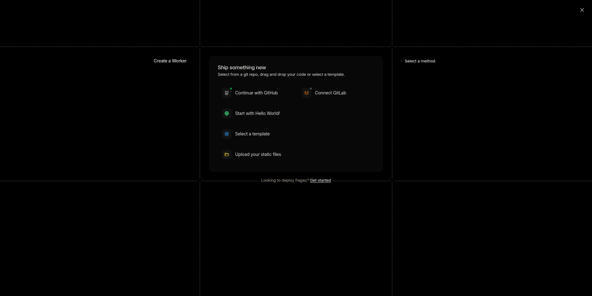

+++
title = "Site migration from AstroPaper to Zola"
date = "2026-04-23"
draft = true
+++

For sometime, i've been thinking to migrate away from AstroPaper to much more minimalist SSG with customization, and I stumbled upon zola. The thing i liked the most is its documentation, provided examples and online resources. I may wanna say its bit outdated, and there're 30+ open PRs + last commit to main branch being commited in the last couple of weeks, i would say project is healthy with an active community.

Its quite easy to get started, visit the [zola site](https://getzola.org) and follow the installation guide to install zola on your operating system. Once installed you may wanna initialize new project.
Once the project is initialized visit the [zola/themes](https://www.getzola.org/themes/) to choose favorite theme. 
Customizing the site is easier as well, i myself is in process of customizing the site. but i would say to follow the docs in ordered manner. be patient, since in this time we're obessesed with speed. read the docs, follow the steps, and you'll be amazed how good zola is. I'm sharing my findings with you guys, and the mistakes i made;
- dont use zola.toml, use config.toml to configure zola, visit [zola configuration](https://www.getzola.org/documentation/getting-started/configuration/) to view all the configuration options available. I don't know how i started using zola.toml, but i corrected myself quickly.
- copy the config.toml of the theme to your base config.toml, to get a boilerplate or starting point to configure.
- the most powerful and extendable block in config is `[extra]`, its your playground, some of the important configuration is tied to it, like logo, taxonomy, toc and others. You can create your own configuration under the `[extra]` block, and refer to it in templates via `config.extra.<property>`

## Cloudflare Pages Deployments

Deployment part took the most of my time, since due to misunderstanding, and outstanding issues on cloudflare side, it took me a good amount of time to deploy my site on cloudflare. Keep in mind, apart from site generation method (AstroPaper -> zola), I also migrated away from netlify -> cloudflare, to benefit from better integration of cloudflare services, since i was already using cloudflare as my DNS provider, so i thought why not utilize its other offerrings, and setting up custom domain for cloudflare pages/workers is a breeze if the site DNS is already configured/managed by cloudflare. I'm outlining some of the deployment steps, and lay out the parts which took most of my time;

- zola docs have guides for both the cloudflare workers and pages. I read the [pages deployment guide](https://www.getzola.org/documentation/deployment/cloudflare-pages/), and tried to followed it.
- cloudflare ui have been changed, and it got me. docs mention to choose "Pages" from the left navbar, but there's just workers/pages now on the side navbar. I clicked on it, and idk who's decision was it at cloudflare to show onboarding for workers first, sliding the pages onboarding to the bottom where someone with only luck can find.

