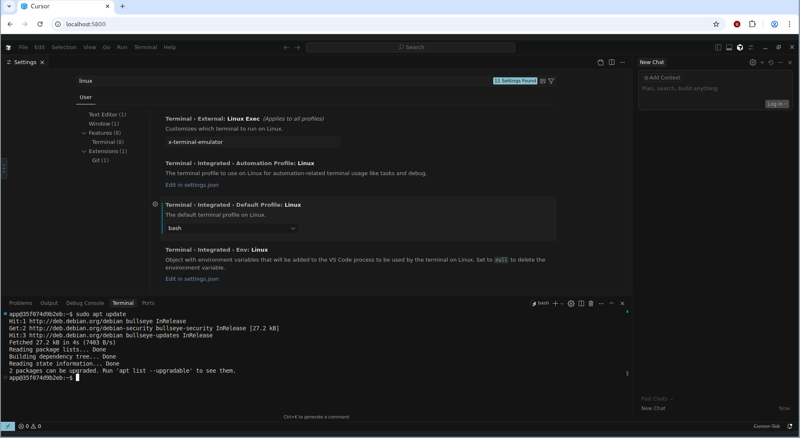
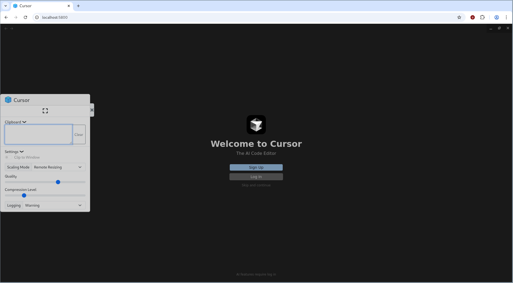
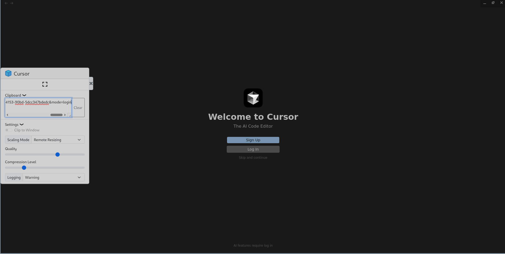

+++
title = "Cursor in a Linux Container"
date = "2025-08-30"
description = "Containerize GUI Apps in Linux containers"
[taxonomies]
tags = ["linux", "containers"]
+++

Lately, I've been into running GUI (Graphical User Interface) apps inside linux containers. Not full desktop environments, just lightweight, single-app containers for quick launch and a clean environment.



## Motivation

My initial motivation was to run [Cursor](https://cursor.com/) inside a container, bypassing the trial limit and too many trials on this machine error. Some folks may point me towards [yx-elite/cursor-limit-reset](https:/github.com/yx-elite/cursor-limit-reset),
but this workaround may work sometimes and not always guaranteed and is always messy. So, I look towards Google started looking CURSOR in CLOUD, as VSCODE is in [GITHUB CODESPACES](https://github.com/features/codespaces) or [PROJECT IDX](https://idx.dev/) by GOOGLE, but my progress was halted as there was none. I starting digging on how GITHUB CODESPACES is being hosted in the cloud, and my initial instincts were they may use virtualization, or some advanced K8s setup and other stuff that may not be available for masses + huge computing machinery available to them, stuff that’s pretty overkill for personal use.

## Discovering the World of GUI Containers

I changed my google query to `run gui apps in linux containers`, and to be honest, I would say I was not disappointed, folks already have been working on it way before the idea hit me, so I had some hopes alive. Many folks online at stackoverflow and several discussions pointed towards this short blog [Running GUI apps with Docker](https://fabiorehm.com/blog/2014/09/11/running-gui-apps-with-docker/) by Fabio Rehm. This post laid the foundation for everything that followed.

I kept digging, and that’s when I really struck gold. I found that people had already successfully containerized apps like Firefox, which led me to even more focused resources after refining my search to `lightweight graphical Linux container`. These turned out to be absolute gems:

1. [Running GUI Applications in Docker Containers by Priyam Sanodiya](https://medium.com/@priyamsanodiya340/running-gui-applications-in-docker-containers-a-step-by-step-guide-335b54472e4b)
2. [mviereck/x11docker](https://github.com/mviereck/x11docker/)
3. [jlesage/docker-baseimage-gui](https://github.com/jlesage/docker-baseimage-gui)

`mviereck/x11docker` is an excellent resource for someone looking to run Desktop Environments inside Linux containers. `jlesage/docker-baseimage-gui` did a fantastic job and provided community with a base GUI image, on top of which any GUI app could be containerized, with additional features, such as VNC, web authentication, secure transport, init scripts, environment variables,
reverse proxy, web audio pass and many other amazing features.

Out of all of them, `jlesage/docker-baseimage-gui` really stood out. So I decided to build my Cursor container on top of that. Customizing container according to my needs was the most significant task I underwent, my initial task list or the challenges I faced included:

1. Downloading and installing the Cursor editor in the container.
1. Have the container user, sudo access (root user privilege for administration purposes, which is blocked by default in containers)
1. Integrate the bash or zsh in the editor, since the default user `app`, have default `/sbin/nologin` shell, which only allows login, and no other stuff, like it doesn't provide any interface (tty) to execute any commands further.
1. How to authenticate myself in Cursor, since when we click the Login button, it opens a browser where we authenticate ourselves on normal machines :), and this container is designed only for single application and doesn't have any modern browser installed (yes, I know about terminal browsers, but that is not the point of discussions here).

## Building the Cursor Container

I went with Podman, but you can use Docker too, the steps are the same.

```bash
# Get the AppImage from Official Website
CURSOR_DOWNLOAD_URL=https://downloads.cursor.com/production/823f58d4f60b795a6aefb9955933f3a2f0331d7b/linux/x64/Cursor-1.5.5-x86_64.AppImage
```

First, here's the base of our `Dockerfile`:

```bash
FROM docker.io/jlesage/baseimage-gui:debian-11-v4

RUN apt-get update && apt-get install -y \
    libpci3 libegl1 libgl1 libgles2 libxcomposite1 libxdamage1 libxrandr2 \
    libasound2 locales xdg-utils fuse libfuse2 libnss3 \
    libatk-bridge2.0-0 libgtk-3-0 libxss1 libatk1.0-0 libcups2 libdrm2 \
    libxkbcommon0 libdbus-glib-1-2 libxcb-dri3-0 \
    sudo bash \
    && apt-get clean
```

In the next step, we will copy our AppImage from our host to the container. We can setup `Dockerfile` in two ways, either we include downloading logic inside `Dockerfile` which would take extra time each time we build the image, and the other is to copy it from the host to container, and this is much faster operation and Docker caching will be helpful in this scenario. I decided to opt for the 2nd option, so go ahead and download the Cursor AppImage and place it along with the `Dockerfile` directory (Build Context). You may download via `curl -L $CURSOR_APPIMAGE_LINK -o Cursor.AppImage`, and then update `Dockerfile` with:

```bash
COPY Cursor.AppImage /tmp/Cursor.AppImage

# Extract AppImage contents at build time to avoid FUSE
RUN chmod +x /tmp/Cursor.AppImage && \
    /tmp/Cursor.AppImage --appimage-extract && \
    mv squashfs-root /opt/cursor && \
    rm /tmp/Cursor.AppImage

# Set app name for GUI container
RUN set-cont-env APP_NAME "Cursor"

# Copy and set permissions on launch script
COPY startapp.sh /startapp.sh
RUN chmod +x /startapp.sh

EXPOSE 5800 5800

ENTRYPOINT ["/init"]
```

Create new bash script file named `startapp.sh`, with the following content to execute Cursor on container startup:

```bash
#!/bin/bash

# Run app
exec /opt/cursor/AppRun
```

Make sure to set the `startapp.sh` script executable with `chmod +x startapp.sh`.

At this point of time, you've working Cursor installation inside of container, and you can build your image and run it to test it with:

```bash
# building the image, note the extra space between mycursor:1 and the dot (.)
# this is important!!! as it tells podman that
# current directory is the build context
podman build -t mycursor:1 .

# list images locally
podman images

# after building, we can run with
podman run -it \
  -e APP_USER_ID=$(id -u) \
  -e APP_GROUP_ID=$(id -g) \
  -p 5800:5800 \
  -p 5900:5900 \
  localhost/mycursor:1
```

Once the container is up and running, you can visit `http://localhost:5800` in your favorite browser and you've Cursor in your browser, but wait you've new error :( saying

```bash
Unable to write program user data.

A system error occurred...
Please make sure the following directories are available:

/config/xdg/config/Cursor
~/.cursor/extensions
/tmp/run/user/app
```

Don't worry, you can easily fix by modifying the `startapp.sh` script to include the following code block before app execution

```bash
export HOME=/config
export XDG_CONFIG_HOME=/config/xdg/config
export XDG_CACHE_HOME=/config/xdg/cache
```

Build the Dockerfile again, and run it following the previous instructions, and then visit `http://localhost:5800` in your browser and you've hopefully Cursor in your browser, also ignore the logs as well :).



## Authentication Trick

We've successfully completed the installation of Cursor inside the container, and now is the time to move on to the authenticating ourselves. Normally, we would click the Login button, and Cursor will open a browser window or tab and authenticate us. But, inside this container, where there is only single application running and no other stuff is allowed.

The solution is simple, just **hover over the Login button and right click on it and copy the Login URL**, wait you tried to paste the link to browser and it didn't pasted. If you carefully see the left side of the window, you can see three vertical dots (if you previously click the `x` button), click on it and you've your copied link there. Again copy it, and paste it in your host machine
browser and authenticate yourself.



## Adding `sudo` to the `app` User

Great job! You've so far, containerized Cursor and authenticated yourself which you previously thought difficult. Now, let's move onto the next step giving our normal user `app` the admin power with `sudo`, so we can install the packages we needed, run some admin tasks via the editor terminal.

In the `Dockerfile`, add two new packages in the packages installation section:

```bash
RUN apt-get update && apt-get install -y \
    libpci3 \
    libegl1 \
    libgl1 \
    ...
    ...
    ...
    sudo \
    bash \
    && apt-get clean
```

Create new bash script named `50-enable-sudo.sh`, make sure to start the filename with `50-whatever.sh` and place the following content in it.

```bash
#!/bin/bash

set -e

# Get app username
APP_UID=${USER_ID:-1000}
APP_GID=${GROUP_ID:-1000}
APP_USER=$(getent passwd "$APP_UID" | cut -d: -f1)

# Recreate sudo group if it’s missing
if ! getent group sudo > /dev/null; then
    echo "[sudo-setup] Creating missing 'sudo' group..."
    groupadd sudo
fi

# Add user to sudo group (optional if using sudoers file directly)
usermod -aG sudo app

# allow passwordless sudo
echo "$APP_USER ALL=(ALL) NOPASSWD:ALL" > /etc/sudoers.d/$APP_USER
chmod 0440 /etc/sudoers.d/$APP_USER
```

Modify the `Dockerfile` to include the `50-enable-sudo.sh` inside container with following snippet:

```bash
COPY 50-enable-sudo.sh /etc/cont-init.d/50-enable-sudo.sh
RUN chmod +x /etc/cont-init.d/50-enable-sudo.sh
```

Build and run the container to ensure there's no error. Up until this point, we have containerized cursor, knows how to authenticate ourselves, and give ourselves admin privileges with `sudo`.

## Switching to Bash Inside Cursor

The last puzzle is on how to overcome the limitation of `/sbin/nologin` default shell assigned to us. I can see two paths for us from here, that are:

1. Use the `sudo` power and change our default shell to `/bin/bash`
1. Change the default shell in CURSOR

For security and ease of doing, I would prefer 2nd option. Open the VSCode Settings inside Cursor Editor (ohh! the irony, VSCode Setting inside Cursor :), and search `linux` in the search bar and you can see 3rd search result being `Terminal > Integerated > Default Profile > Linux`, change it from `null` to `bash`. Woooh! You've bash inside, the Cursor with `sudo` power,
and now you can start building amazing things.


## Docker Registry

To save some time of you all, I've pushed the built image to docker registry, which is available at [recluzegeek/cursor-container](https://hub.docker.com/r/recluzegeek/cursor-container). Follow these steps:

1. Download either [Docker](https://www.docker.com/) or [Podman](https://podman.io/)
1. Run this command in the terminal afterwards:

```bash
docker run -it \
  -e APP_USER_ID=$(id -u) \
  -e APP_GROUP_ID=$(id -g) \
  -p 5800:5800 \
  -p 5900:5900 \
  recluzegeek/cursor-container
```

Visit `http://localhost:5800` in your browser.

## Tips

1. Use tools like **Remmina** for better remote GUI access than the browser.
1. Use bind mounts or volumes to easily share files between your host and container.

## Caveats

1. Cursor might crash inside a container if you’re low on resources.
1. Some weird bugs might pop up, that's life in containers.

## Final Thoughts

Honestly, I didn’t think I’d end up this deep just to run a single editor in a container, but here we are. What started as a workaround for Cursor’s trial limit ended up teaching me a whole lot about GUI containers, app isolation, and container-based desktops.

Yeah, some parts were a bit tricky—like dealing with missing `sudo`, changing default shells, and that whole login flow without a browser—but it was actually fun figuring it all out step by step. The community tools like `x11docker`, `docker-baseimage-gui`, and blogs from folks who’ve been down this road before helped a ton.

Now I’ve got a fully working Cursor running in a container, with admin access, proper terminal, and no annoying trial limits. Super lightweight, fast to boot, and feels pretty clean overall. If you’re into tinkering, or just want to run apps your way without bloated VMs or cloud IDE limits, containerizing GUI apps is 100% worth diving into.

Let me know if you end up building something on top of this, or hit a cooler way to do it. Always down to nerd out more.
