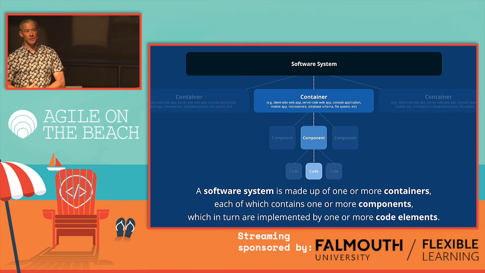
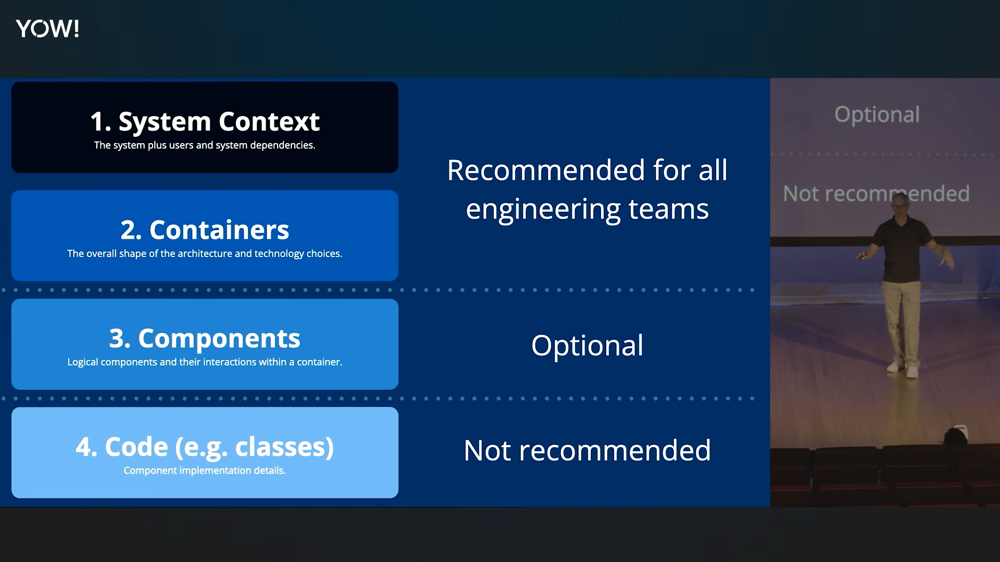

+++
title = "C4 Model - Visualizing Software Architecture"

date = 2026-07-12
updated = 2026-07-12
draft = false

[taxonomies]
tags = ["software-architecture"]

[extra]
dek = "visualizing software architecture with C4 model."
+++

## motivation

I was looking into diagrams-as-code, as I'm architecting microservices at work, and I stumbled upon [diagrams](https://github.com/mingrammer/diagrams) - more suitable for deployment diagrams, although related but not for software designs. I knew about the existence of [mermaidjs](https://mermaid.js.org/), and [PlantUML](https://plantuml.com/), but either their syntax is complex for me, or their rendering wasn't at par - I wasn't satisfied with both. One day scoundering the web, I landed on [structurizr](https://structurizr.com) and I realized I'm done with my search. Before looking into strucutrizr I realized, Its a tool for C4 model diagrams, so I first looked into it.

## introduction

[C4 model](https://c4model.com) is notation independent, software model which propose we visualize our software architecture at 4 different levels, aiming at different audiences, each level for a seprate audience:

- [system context](https://c4model.com/abstractions/software-system) - high level overview of the system thats easily understandable by the non-technical audience
- [containers](https://c4model.com/abstractions/container) - represents an application, data store and != docker container. Always deployable.
- [components](https://c4model.com/abstractions/component) - each container is made up of components, which can be represented as modules which is a collection of related functionality
- [code](https://c4model.com/abstractions/code) - basic building block, not recommended to visualize. We've can either look at the source code directly, or utilize IDEs to map things out.

## tooling

C4 model is tooling and notation independent, thereby rich ecosystem exists around c4 model, you can find out about [here](https://c4model.com/tooling), but I suggest looking into these:

- [structurizr](https://docs.structurizr.com/)
- [c4interflow](https://www.c4interflow.com/)

## learning resources

here're some resources you can reach out to for more knowledge, simon brown (creator of C4model & structurizr) put up good talks revolving around software architecting, some are:

- [Visualising software architecture with the C4 model - Simon Brown, Agile on the Beach 2019](https://www.youtube.com/watch?v=x2-rSnhpw0g) - amazing talk, you'll learn the most from this talk about C4.
- [The C4 Model - Beyond The Basics • Simon Brown • YOW! 2025](https://www.youtube.com/watch?v=FqTL-_tLf6I) - simon brown shares tips from his experience
- [C4 models as code - Simon Brown - NDC Oslo 2023](https://www.youtube.com/watch?v=4HEd1EEQLR0) - simon talks about the C4 ecosystem, giving demo of his structurizr tooling, and code as well.

and don't forget about their docs. I confess that the first time, I got to know about structurizr and C4 model - they didn't made sense to me, I was just looking for quick dirty work to create beautiful deployment images from code. But thats not the case anymore, after watching the above 3 talks by simon, going back to the docs makes lot more sense and I can read them nowwww.
