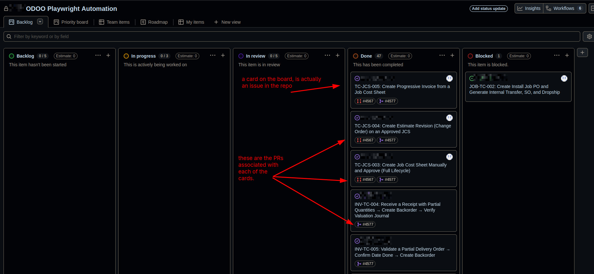

+++
title = "Playwright Tips - Python"

date = 2026-06-10
updated = 2026-06-10
draft = false

[taxonomies]
tags = ["automation-testing", "playwright", "python"]

[extra]
dek = "Hard-learned Python Playwright lessons and workflow optimizations after two quarters in production."
+++

## Motivation

I was always interested in automation testing, but not had the opportunity to work on it, as I had set other priorities during my studies, such as focusing on DSA, OS, CC, Networking, so never had the chance to work with any automation framework. At work, I was assigned to do automation testing for Odoo14 CRM instance, given I'll be provided with the test cases in written form by QA, so I set out on setting up the infra via GH actions to run the test suite when code is pushed to main branch for regression testing (testing existing working flow, to ensure nothing gets broken on new changes).

Thanks to AI and another reference project that used playwright for its automation (with typescript), I was able to get up and start quickly. The project helped me a lot, and I used it as reference ground for my python-playwright setup. I mostly copy/pasted its infra that included its `.cursor` rules and tweaked them to the Odoo14.

### Optimizing the Flow

I was only passed written testcases for about month, and it was time to optimize it by myself. My testing flow for couple of months was like this,

> QA will have meeting session with module expert (Odoo has tons of module - Accounting, Jobs, FSM, Contacts, ...), it gets recorded for later use. I revisit the recording, write testing steps by hand on diary, then perform those exact steps on the staging environment to validate those steps, then write those steps back to a ticket.

I decided to use [Github Projects](https://docs.github.com/en/issues/planning-and-tracking-with-projects/creating-projects/creating-a-project) for tracking/managing automation tickets, since I don't want beaurocratic process of JIRA management, GH project nicely integrates with the repo Issues, PRs and thats what I was looking. So, I create issues which becomes tickets in the GH project and then the normal flow, TODO -> In Progress -> Review -> Done. But, before writing even single automation line, most of my time was being consumed by the ticket creation process, but I started to think to automate the project after 4 months, so I sat and researched ways of passing video + transcript to claude and make this process automated.

Since meeting videos were recorded and saved to Sharepoint, I didn't had access to download them, so instead of asking host for access everytime, I landed on [ms-teams-sharepoint-downloader](https://github.com/brendangooden/ms-teams-sharepoint-downloader), and [added support for firefox](https://github.com/brendangooden/ms-teams-sharepoint-downloader/pull/10) in it - since I was on linux, I prefer not to use Chrome as my primary everyday browse. I added [claude-video-vision](https://github.com/jordanrendric/claude-video-vision) as mcp server to my claude to give it video vision power, powered by ffmpeg - old legend that never dies even in the age of AI.

Now all the ingredients are here, just need to wire them so i created new command under `.claude/commands` with args of video, and transcript file, and provided rule under `.claude/rules` on how to create tickets for the test case by taking things in parallel with video, and transcript.

> crux is not to automate things in the beginning - avoid premature optimization. Perform the task manually first to fully understand the problem and architect the right solution. Automate only when high frequency and strong ROI justify it

## Tips

Here're some more tips that I gathered during this period:

- use [playwright codegen](https://playwright.dev/docs/codegen) for finding the locators only, don't rely on it heavily for designing your tests - they won't scale better

- know when to refactor your codebase at the right time before it starts to become messy - this becomes more crucial if codebase is being AI generated

- always prefer using [playwright recommended locators](https://playwright.dev/docs/locators), over messy css based selectors

- prefer adding abstractions around common operations, like for example in my case, my automation test scenarios heavily relies on interacing with Odoo Tables, Many2One (dropdown) fields and OdooChatter box for assertion, each of them is notorius to automate, once I've automate them - I create abstractions around each of them and used them across my codebase without duplication, so never to endure the pain again.

- utilize python dataclassess for passing data throughout the tests, fixtures, and pages

- create pytest fixtures to reuse tests; they're really helpful for tests pre-requisites. If Test B requires to repeat the same flow automated by Test A, I invoke Test A as a fixture. Test B seamlessly picks up right where Test A left off, its similar to linux pipe system, where previous commands output becomes input for the next.

- use `PWDEBUG=1 pytest tests/test_xyz.py -s -v` this would run test with the built-in playwright debugger - this was the feature I missed a lot in the beginning, and only came to know about couple of weeks ago. You can use it for real-time debugging for finding the correct locators via codegen. If you switch to its log tab, you can see where's the progress, it would highlight the locator as it runs the test, what's stalling the test case, which component needs its locator to be updated, and whats causing timeouts, etc etc. ~~I know if my memory serves me correctly, typescript version of the playwright, there's lot missing features in the python version of playwright regarding ecosystem, like live locator debugger~~

- playwright traces are your best friend in town - before I came to know about `PWDEBUG=1 ...` command, I relied heavily on playwright tests to debug the issues during development.

- install and use [playwright vscode extension](https://playwright.dev/docs/getting-started-vscode) for running, and debugging the playwright tests - it seamlessly integrates within the vscode ecosystem, the part I like the most of it is its debugging terminal section, where I can change the variables value at branching paths to see how my test would behave - this is what I was missing in the playwright debugger - builtin doesn't support it, its good at locating/debugging locators only.

- use reporting and decorators one similar to [allure](https://allurereport.org/)

- playwright docs are awesome - specially for python, visit them once a while. You can have `normalize()` function, its just awesome, takes in accessibility tree locator, and outputs the recommended version of it. This function is availble in v1.59+, so I upgraded my entire toolchain for it.

- implement POM (Page Object Model - similar to OOP) - idea is to have base_page for the module I'm testing, like for example `pages/accounting/base_page` where shared locators, and functions would exists for the entire accounting module, that includes save, cancel, approve or common buttons. Then for specific to each test, I create page which would extend that `base_page` via inheritence to get all those functionalities/locators without duplication. Its the first time in my career where I'm implementing something close to OOP, elsewhere its functional programming.
