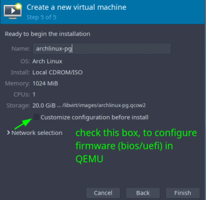
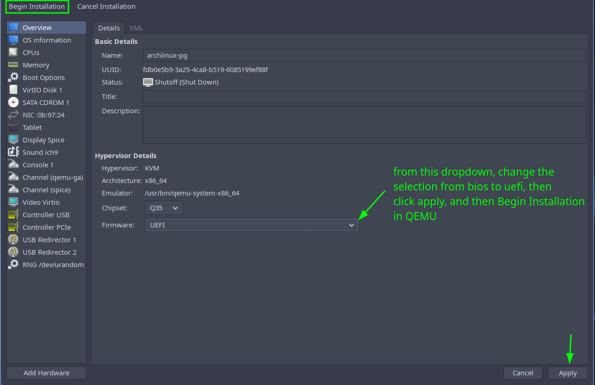
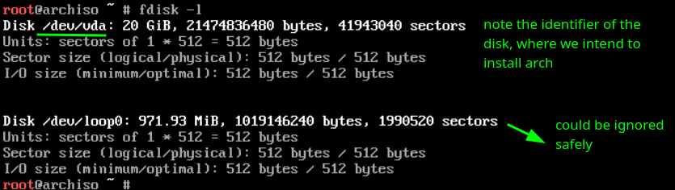
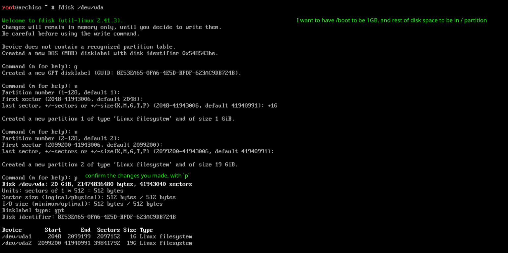
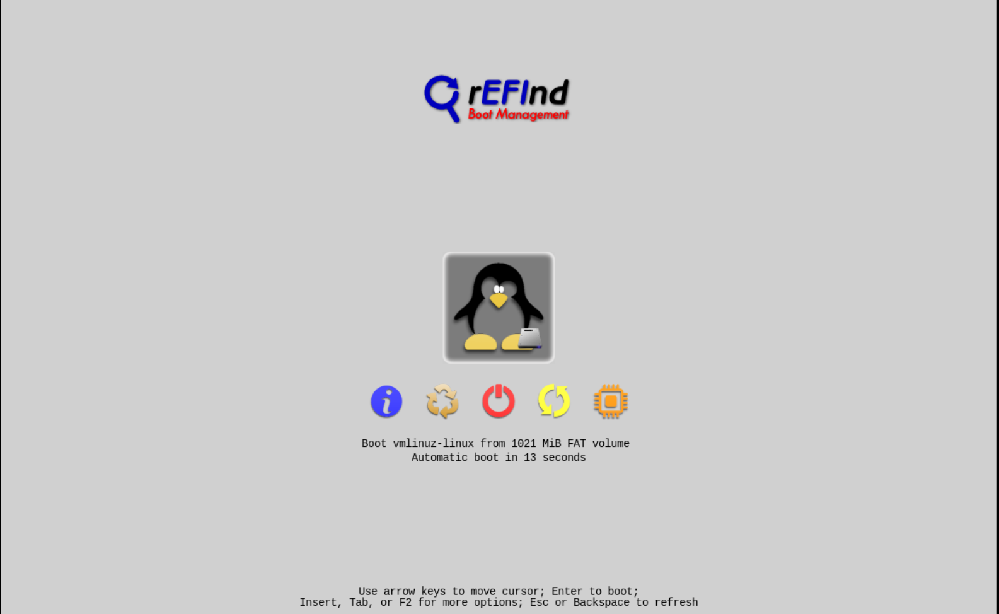
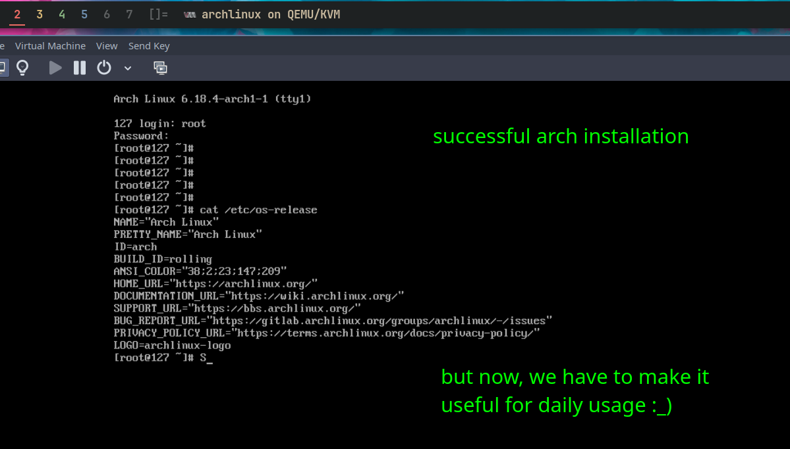

I've been linux user for more than 3 years, and during this period I've had used various distros as vms, and on bare metals. Moving to linux upgraded my learning curve, and i got to know about new things everyday, and I can't be more thankful to past myself for choosing to switch to linux, long before windows start shiftting AI Slop. I used mint, debian, fedora (for sometime), manjaro, and a long time with arch derivatives like Endeavour, and Arco Linux. However, I've always this etching to install arch without any scripts and wayarounds, and I'm happy that i tried to do so, and this post is documenting my journey, and contains fixes of the problems i faced along the way.

Fetch the latest arch iso from either torrents or directly downloading. My host OS is arco linux, and will experiment in as a virtual machine in QEMU/KVM. Keep archwiki installation page open for your guidance (recommended).

## Installation

- make iso bootable, and load iso from bootable usb. make sure that you select right bootloader firmware either uefi/bios based on disk configuration (MBR/GPT). If you're trying in VM, go with GPT/UEFI combo, and make sure to select UEFI as boot loader firmware (this step would save you time, believe me). You can later edit the firmware in virtual box, and vmware (i believe), but can't on QEMU (you've to choose while creation, so select it). For QEMU, see virt-manager - Change firmware AFTER installation





- Once the iso boots up, and you're presented with tty/console, we start our adventourous journey of arch installation. Since, we're inside the VM, we already should have internet access. Try to `ping google.com` to confirm. If sucessful, goto next step, else configure the network setup via ip.
- Configure the date time and timezone settings for the installer, via `timedatectl set-timezone <your_timezone>`, list of timezones can be viewed using `timedatectl list-timezones`
- Now, comes the fun and bit risky step of partitioning disks. I recommend to remove all other disks from system, other than the disk on which you intend to install arch. Make some schema layout on how you want disk paritioning to happen. List of recommended paritioning layouts can be found here. I'm going with simple layout of having /boot and / for home directory, with I giving /boot 1GB, and rest goes to / . Whatever layout you choose, steps/concepts are approx. same
  → first convert the disk to either MBR/GPT structure.
  → create new partition with the least space you want to give, like in my case, i want to give 1GB to /boot, so i'll first create the /boot partition.
  → then comes the other partitions in your layout, like in my case, next in line would be /, you may have /home seprate, or a /swap.
  → general order i would recommend, /boot > /swap, /home, /
- Let's get the theoretical portion aside, and do the partitioning. Don't worry, nothing gets written to disk unless you specify `w` to instruct fdisk to write the memory changes to disk. List available disks by `fdisk -l`, this would list the disks attached to system, results with rom, loop or airootfs may be ignored. In my case, I got the following result



→ Next, we select the disk using `fdisk /dev/<specifier>`, in my case i would use `fdisk /dev/vda`, and I would be inside TUI (Terminal UI) of fdisk, where I could create/delete parition, change the partition tables (MBR/GPT). Feel free to enter `m` for help inside the TUI.
⇒ As we discussed, we will convert the disk's partition table schema to either MRB, or GPT. Press `g` for GPT or `o` for MBR schema. I will go with GPT in further steps, if you want to go with MBR schema, you need to do some extra steps like choosing primary/extending partitions. May read more about MBR here
⇒ Now, we'll create new partition for /boot. Press `n` for new parition, go with defaults for Partition Number, First Sector and in Last Sector, we can give the space in MB, GB, TB using M, G, and T. Like, I want to give my /boot partition to have 1GB space, I can give `+1G` as input, or if I want it to give 500MB, I can give `+500M`, be sure to add `+` in front of space, otherwise it'll give error of `value out of range`.
⇒ Now, we'll create new partition for / partition, which will contain all our installation, and user data. Again, create new partition using `n`, go with the default for Partition Number, First Sector, and for Last Sector as well, since we want it to take the entire left space on disk. If we don't want that you may specify the Last Sector as GB, TB as we did in the last step.
⇒ Similarly, we can create /swap, /home partitions as well.
⇒ Once, you made your changes, confirm that everything looks correct using `p` to print the current partition table. If something doesn't looks good, you can nuke the process, by quitting the fdisk using `q`, or deleting the partition. No data will be written to disk, since all changes are in memory, and will get written to disk once `w` is pressed.
⇒ Persist the changes with `w`, or `q` to nuke if you did something wrong. On successfull completion, should look like this



- Once the partitioning is completed, we will install the filesystem on these partitions, like on / partition, i want it to have ext4 filesystem, linux supports a number of filesystem with varying number of advanced features. For /boot partition, docs recommend it to be of type fat32. read more about filesystem here

```bash
mkfs.ext4 /dev/vda2		# for ext4 filesystem on /vda1 or / partition
mkfs.fat -F 32 /dev/vda1	# for /boot
```

- Now, we're done with partitioning, and filesystem, lets mount the partitions to the respective directories inside live system to begin system installation.

```bash
mount /dev/vda2 /mnt			# mount /dev/vda2 partition to the /mnt directory
mount --mkdri /dev/vda1 /mnt/boot	# create /mnt/boot directory and mount /dev/vda1 to it
```

If you created swap, turn it on using `swapon /dev/<partition-number>

- Install the base packages using pacstrap, I recommend going with the base/required packages, and installing required packages along the way.

```bash
pacstrap -K /mnt base linux linux-firmware micro
```

micro is terminal text editor.

If you see any errors related to missing `/etc/vconsole.conf` file, don't worry, we'll create it once we changed our shell root, and we'll recompile it their as well.

- To get needed file systems (like the one used for the boot directory /boot) mounted on startup, generate an fstab file. fstab file auto mounts the disks to system on boot.

```bash
genfstab -U /mnt >> /mnt/etc/fstab
```

Confirm the generated fstab file matches the actual partition UUIDs. Read the fstab file using `cat /mnt/etc/fstab` and `lsblk -f` to list the partitions along with their UUIDs. Confirm the UUIDs matches.

- So far, we've been working inside the shell of live iso system, now we will change our shell to the shell inside /mnt or / partition - the system we'll be going to install.

```bash
arch-chroot /mnt		# change the root from live iso to /mnt mount point which contains our root `/` partition - the partition where we're gonna install the system
```

- Set the timezone, and sync hardware clock:

```bash
ln -sf /usr/share/zoneinfo/Area/Location /etc/localtime				# Area/Location can be replaced with <your_timezone>

hwclock --systohc 				# sync the hardware clock
```

- Define the language, and keyboard settings. Edit the `/etc/locale.gen` using micro `/etc/locale.gen` and uncomment the locales you want, in my case I would uncomment the `en_US.UTF-8` on Line 171 and save it. Next, we'll create new file `vconsole.conf` which will store the keyboard layout, and fonts setting which will be loaded on tty or in console. Use `micro /etc/vconsole.conf` to create and open the file. In my case, I pasted the `KEYMAP=us-acentos` in the file.
  → Once we've made the changes, we'll build our image that failed earlier during pacstrap installation step, and that is by using `mkinitcpio -P`. The rule for now is to run `mkinitcpio -P` whenever you change the locale or keyboard layout related things in vconsole.conf. Successful run of `mkinitcpio -P` will produce initramfs which will boot us
- Install newtwork-manager, refer docs for more example
- Set password for root account, via `passwd`
- Install bootloader, you've plenty of options, and I would recommend installing `refind` over `grub`, since it saves time, and is customizable, and pretty by default as well. See docs for more explanation
  → install via `pacman -S refind`, and post-installation, run `refind-install` and it will automatically install the refind binaries to appropriate partitions and update the `/boot/refind_linux.conf`
  → Now, if you exit out the live system and try to reboot you'll hit the error, saying

```bash
Starting Switch Root...
[FAILED] Failed to start Switch Root.
See'systenctl status initrd-switch-root.seruice' for details.You are in energency mode.After logging in, typesystem logs,"sustenctl reboot" to reboot, orexitjournalctl -xb" to uieuto continue bootup.Cannot open access to console, the root account is locked.
See sulogin(8) man page for more details.Press Enter to continue.
```



- to fix it, just run `mkrlconf` to update the `/boot/refind_linux.conf` and comment other entries by plaing `#` in front of all entries except the one with your `/` partition entry.
- Now, we've arch installed, just type `exit` to exit out of the `/mnt`, and then type `umount -R /mnt` to unmount the `/mnt` partition, and then reboot.
- On rebooting, you should be into your brand new arch installation.


