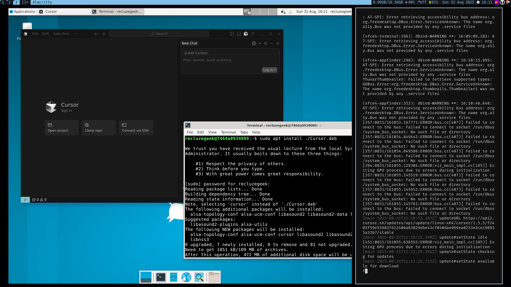

A few days ago, I posted a detailed guide on how I got **Cursor** running inside a container using `jlesage/docker-baseimage-gui`. And honestly? That setup worked. But “worked” and “worked well” are two entirely different things, and over the past few days, I kept running into issues that pushed me to look elsewhere.



I’m talking:

- Cursor crashing randomly after a few minutes.
- Keyboard input stuck in VNC, had to refresh the page to get it working again (and again... and again).
- Folder sharing with host via bind mounts = permissions hell. Either container complained or the host did. No clean workaround.
- Making the user `sudo`-ready took extra scripts and hacks.
- Debugging startup issues? Welcome to `cont-init.d` hell.

It was becoming messy real fast.

## Table of contents

## Why I Gave Up on Single App Containers

All I wanted was a clean setup to run Cursor with:

- Bash shell working inside it.
- Sudo powers.
- Ability to install/update software.
- Folder sharing without pain.

But what I ended up with was me hacking around every edge case, even though the whole point of containers is to keep things **simple and reproducible**.

Sure! Here’s a rephrased, cohesive version of your section in a smooth, natural tone — nothing important left out, just easier to read and more conversational:

---

## Meet `x11docker`

When I first looked at `x11docker`, it felt like complete overkill. I mean, a full desktop environment? Just to run Cursor?

But here’s the thing: sometimes it’s better to go with something that’s **simple, stable, and a bit heavier**, rather than wrestling with a lighter setup that needs constant fixing and tweaking. After dealing with all the headaches in `jlesage/docker-baseimage-gui`, switching to `x11docker` felt like a breath of fresh air.

Turns out, `x11docker` isn’t just good, it’s _perfect_ for running full Linux desktop environments inside containers. It’s clean, extendable, and doesn’t rely on clunky VNC or browser-based access. And the best part? It just works.

### Why x11docker clicked for me

Here’s what makes `x11docker` such a solid choice:

- No lag, no stuck keys, just smooth interaction.
- Offers remote access options (SSH, VNC, or HTML5).
- Clipboard sharing with the host just works, out of the box.
- Run either full desktop environments or single GUI apps (seamless mode).
- File sharing? Super easy. No mount permission hell, just use `--home` and you’re good.
- Comes with sane security defaults, but lets you enable `sudo` if you need admin access inside.
- Requires almost nothing on the host, just X and either Docker, Podman, or nerdctl. (For smoother experience, `nxagent` or `Xephyr` is recommended. You can also use the prebuilt `x11docker/xserver` image.)

If you’ve used `docker-baseimage-gui` before, you’ll feel the difference immediately. No hacks. No scripts. No weird workarounds. Just a fully working Linux desktop in a container, with zero drama.

## My `x11docker` Setup

Here’s how I set it all up. I’m using `podman` here, but you can easily swap it with Docker, the commands are basically the same.

```bash
# xfce desktop with dev tools
FROM x11docker/xfce

RUN apt-get update && apt-get install -y \
  git curl apt-utils sudo gnupg

# install Node.js if required
RUN curl -sL https://deb.nodesource.com/setup_24.x | bash -
RUN apt-get install -y nodejs
```

Save that as `Dockerfile`, and build the image:

```bash
podman build -t x11docker-xfce:1 .
```

## Running the Container

Here's the command that works beautifully for me:

```bash
x11docker --desktop \
  --backend=podman \
  -I \
  --clipboard \
  --cap-default \
  --sudouser \
  --home \
  x11docker-xfce:1
```

Let’s break this down:

- `--desktop`: Start a full XFCE desktop session, remove it if you want seamless mode
- `--backend=podman`: whatever you're using as your containerization tool
- `-I`: Enable internet access (no network jail)
- `--clipboard`: Sync clipboard between container and host
- `--cap-default`: Use default container capabilities
- `--sudouser`: Lets the container user run `sudo`
- `--home`: Automatically persist home directory between container runs

## Persistent Storage

Thanks to the `--home` flag, everything inside your home directory sticks around between sessions. That means:

- Whatever you download inside the XFCE session (e.g. Cursor `.deb`) stays.
- These files are available in host at:

  ```bash
  # default shared folder when --home flag used
  ~/.local/share/x11docker/x11docker-xfce/
  ```

- Want to copy a file from host → container? Just drop it in that folder.

Clean. Predictable. No permission nightmares.

## Installing Cursor

The only manual step I do each time is installing Cursor, which is no big deal.

1. Download the `.deb` and place it inside the shared home folder.
2. Inside XFCE, just run:

   ```bash
   sudo apt install -y ./Cursor.deb
   ```

It takes 5 seconds. And once done, Cursor launches perfectly in a full desktop session.

## Compared to `docker-baseimage-gui`?

| Feature                    | `docker-baseimage-gui`               | `x11docker`                            |
| -------------------------- | ------------------------------------ | -------------------------------------- |
| **GUI Backend**            | VNC in Browser                       | Native X11/Wayland (real desktop)      |
| **Input Issues**           | Frequent keyboard glitches           | Smooth native input                    |
| **Folder Sharing**         | Messy, permission issues             | Simple with `--home` or `--share`      |
| **Requires Init Scripts?** | Yes, for sudo/shell/entrypoint hacks | Nope                                   |
| **Installing apps**        | Needs hacks + volume mounts          | Just `apt install` inside XFCE         |
| **Desktop Environment**    | None (single-app focus)              | Full XFCE or LXQt (or any DE you want) |
| **Performance**            | Lightweight, but VNC limited         | Slightly heavier, but native UX        |

## Final Thoughts

If `docker-baseimage-gui` was my first real taste of GUI containers, then `x11docker` was the upgrade I didn’t know I needed.

I’m now running:

- A full XFCE desktop inside a container
- With `Cursor`, `Node.js`, `Git`, `bash`, `sudo`, and everything else I need
- Seamless host ↔ container file access
- No browser VNC jank
- No extra init script hacks
- No weird sudo workarounds

I can focus on building, writing, coding, without debugging the container itself every 5 minutes.

If you’ve worked with my previous setup even for a **couple of days**, you’ll **immediately appreciate the beauty** of `x11docker`. It's a bit heavier, sure, but you **get your sanity back**.
